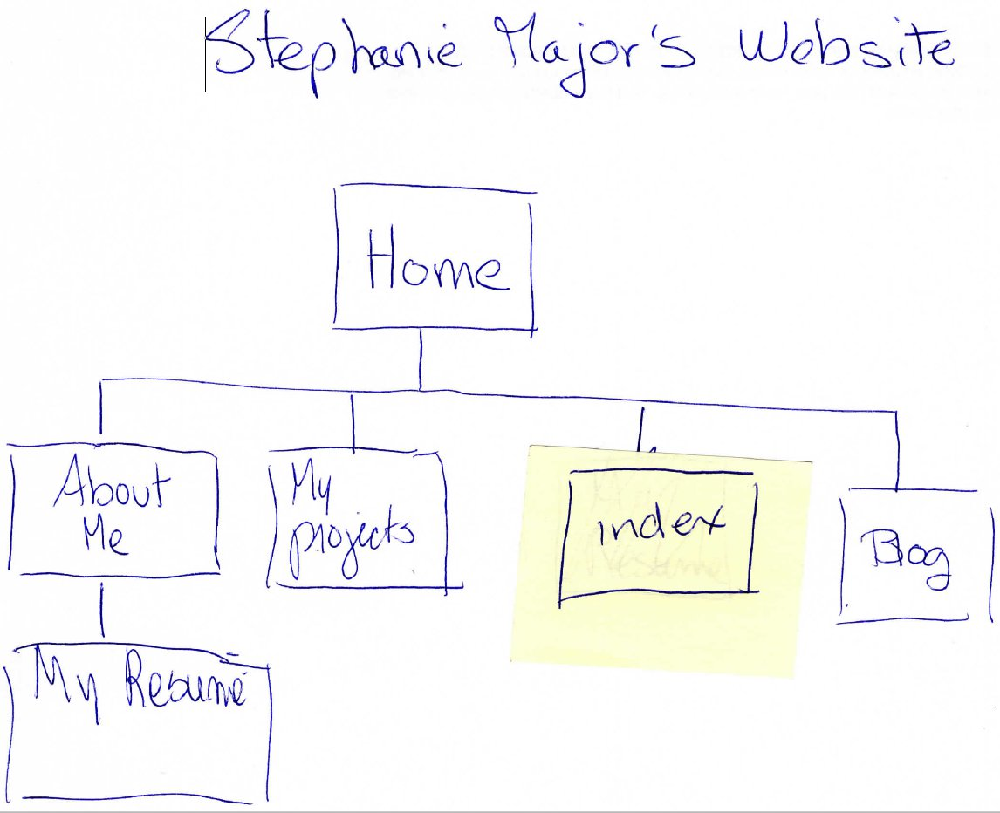

<a href="imgs/site-map.jpg">My Site Map</a>

What are the 6 Phases of Web Design?

<ol>
<li>Information gathering</li>
<li>Planning</li>
<li>Design</li>
<li>Development</li>
<li>Testing & delivery</li>
<li>Maintenance</li>
</ol>

What is your site's primary goal or purpose? I am hoping to attract future employers to look at my credentials and be interested in what I can offer them.

What kind of content will your site feature? What I can do in software development. My background

What is your target audience's interests and how do you see your site addressing them?

Employers are interested in knowing what types of programming languages I learned, they might want to know about projects I have done. They would be interested in knowing what experience I have prior to programming, since a knowledge of a topic (accounting, translation, finance) or an industry (telecom, biotech, etc) could help a front end programmer to better understand what the interface should have. A backend programmer would know what capability the software should provide. 

What is the primary "action" the user should take when coming to your site? 

Move to the languages I know. Move to my background

Do you want them to search for information, contact you, or see your portfolio? It's ok to have several actions at once, or different actions for different kinds of visitors.

 Seeing my resume is OK, as long as it is generic. I prefer provide the more detailed resume upon demand. Seeing my programing projects is OK. I also prefer to provide the code I wrote upon demand as well.

What are the main things someone should know about design and user experience?

 The user’s experience is influenced by usability, navigation, accessibility. These 3 characteristic are created by the web designer.

What is user experience design and why is it valuable? 

The success of a website depends on the user’s perception. The user’s perception depends on the design of the website. The perception will be based on ease of use, pleasant to use, utility, efficiency

Which parts of the challenge did you find tedious? Dealing with markdown. Converting my scanned image into a jpg file.   couldn't find why my image wouldn't copy on my md file.

