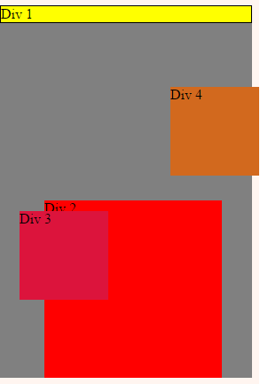
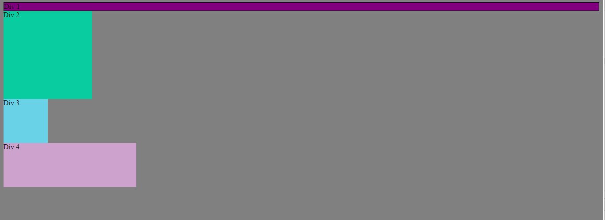
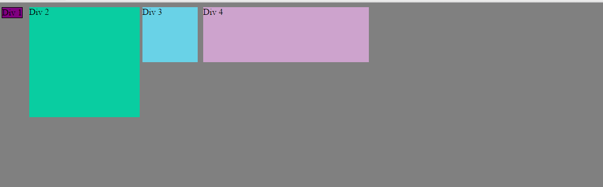
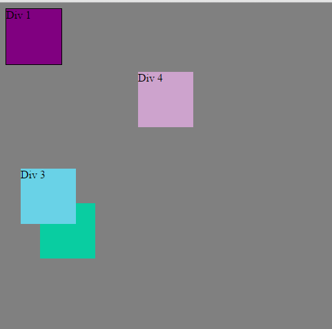
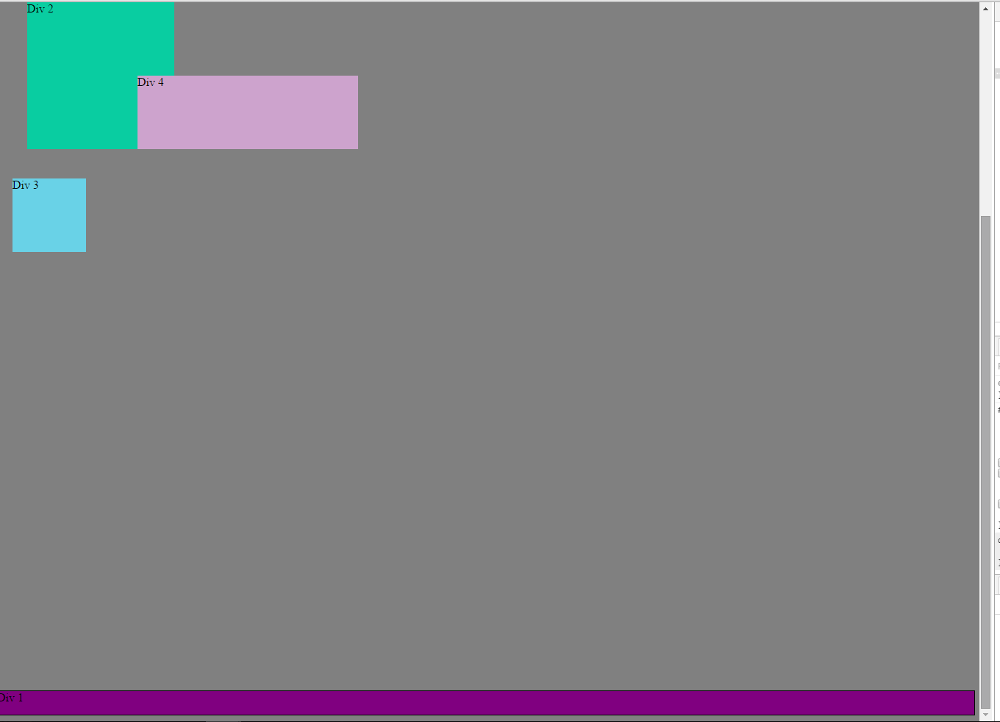
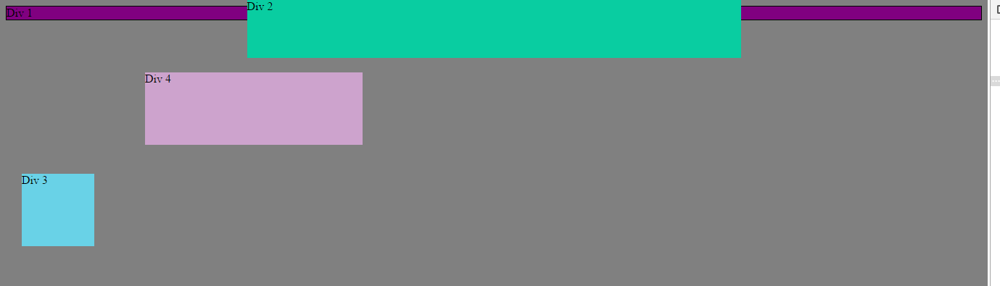
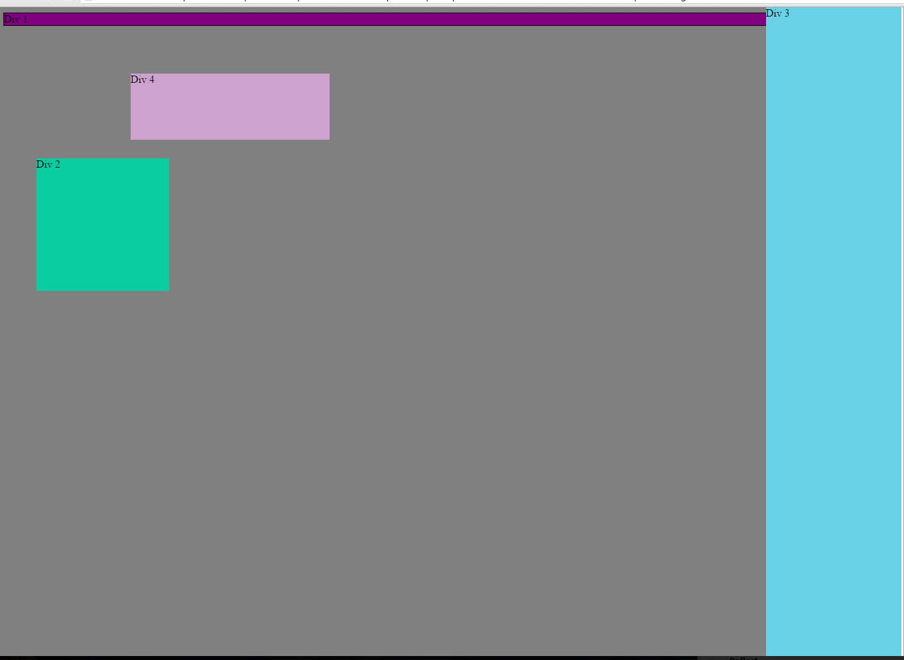
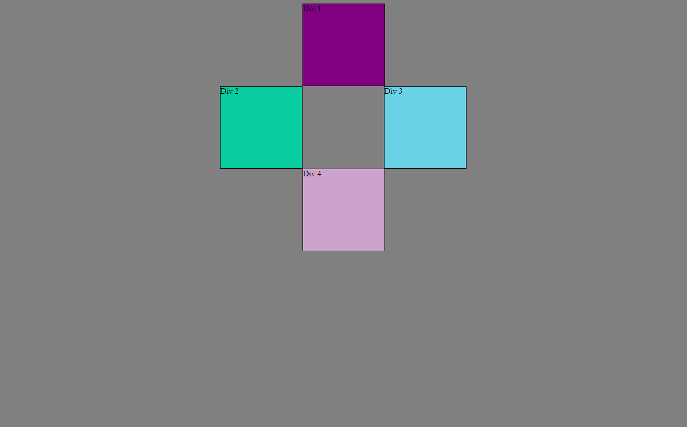

<h3>Pairing session – Positioning with Chrome’s dev Tools</h3>

Change the color

 

Column

 
 

Row

 
 

Make Equidistant

 
 

Square

 
 

Footer

 
 

Header

 
 

Sidebar

 
 

Get Creative

 
 

<h5>Reflect</h5>
<ul>
  <li>How can you use Chrome's DevTools inspector to help you format or position elements?</li>
    
You use it to see the impact tight away without having to change the code. Also you can see their formatting and options for each attribute

  <li>How can you resize elements on the DOM using CSS?</li>
    
We can resize by playing with margin, padding, width, and height, 

  <li>What are the differences between absolute, fixed, static, and relative positioning? Which did you find easiest to use? Which was most difficult?
    <ol>
      <li>Static: each elements sit on each other</li>
      <li>Relative: the elements move in relation to each other (like scrolling down a Word document)</li>
      <li>Absolute. The element just stay there, no matter where the other elements are</li>
      <li>Fixed: it is a type of absolute positioning. Even if you scroll up or down, you will see exactly at the same place on your screen.</li>
      
None of them were easy to use. It will come with practice.

    </ol>
  <li>What are the differences between margin, border, and padding?</li>
    
The margin, the boxes won’t be touching each other. Using the padding, the writing inside the box won’t touch the border and the border gives appearance to the lines around the padding (thick or not, dotted line or not). The border in CSS works the same way than in Excel (although, there are more possibilities in Excel. 

  <li>What was your impression of this challenge overall? (love, hate, and why?)</li>
    
We struggled and got frustrated. We are not into positioning in CSS yet.

